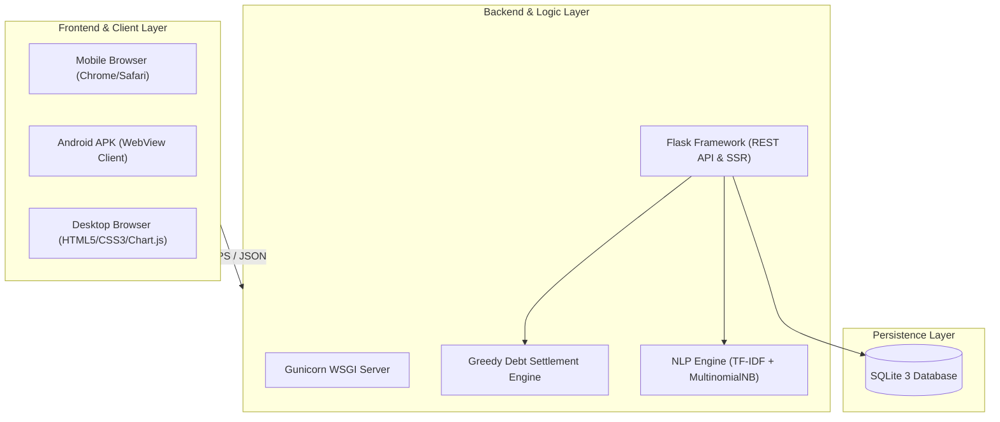
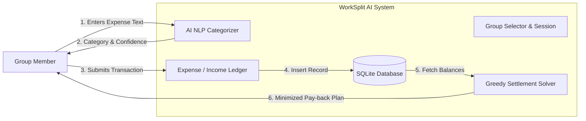
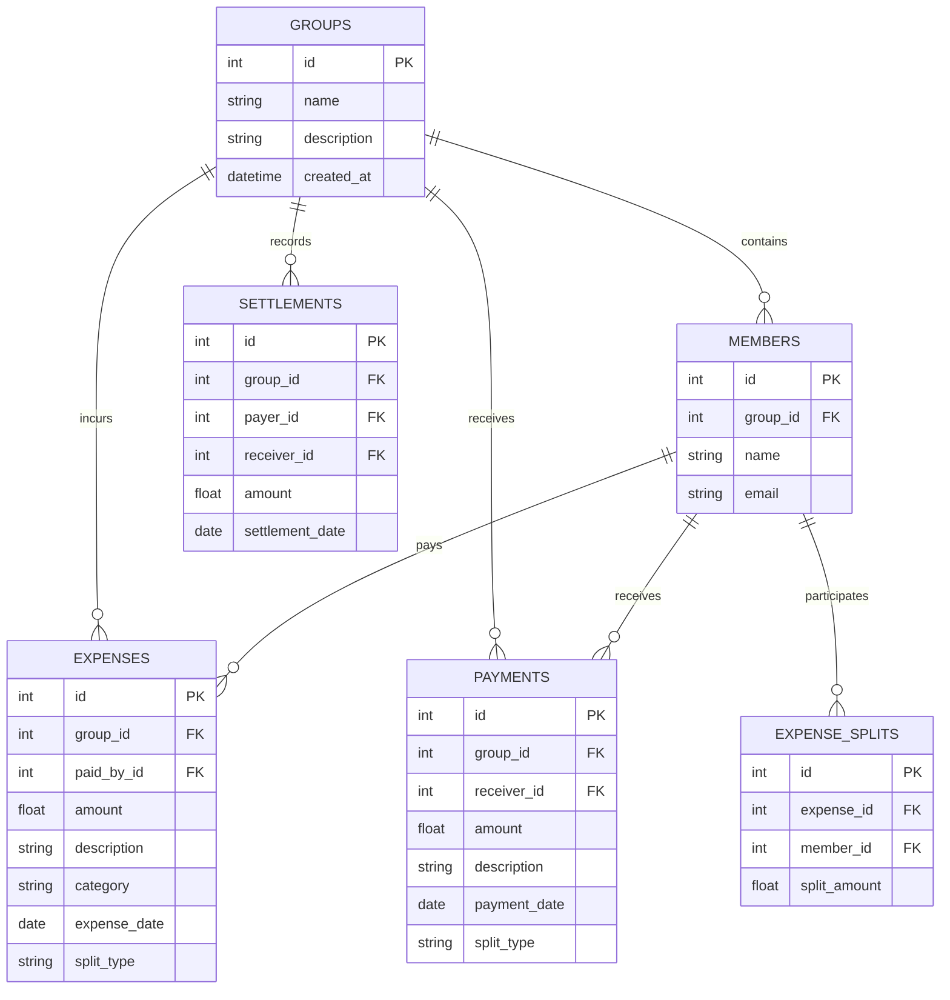

# PROJECT REPORT
## **WorkSplit AI: AI-Powered Group Payment & Expense Settlement System**

---

### **A Project Report Submitted in Partial Fulfillment of the Requirements for the Course**
### **Master of Computer Applications in Artificial Intelligence (MCA-AI)**
### **Subject:** Web Application Development (WAD)

**Faculty of IT & Computer Science**  
**Parul University, Vadodara, Gujarat, India**  
**Academic Year:** 2025 – 2026

---

### **Submitted By:**

| Student Name | Enrollment Number | Role / Contribution |
| :--- | :--- | :--- |
| **Bishal Khanal** | `2505112120220` | Full-Stack Architecture, Flask Backend & Android Studio APK |
| **Jiya Upadhyay** | `2505112120188` | Machine Learning Pipeline & UI/UX Mobile Design |
| **Dhawal Kumawat** | `2505112120230` | Database Design, Settlement Algorithm & Testing Suite |

**Repository:** [https://github.com/BishaL809/worksplit-ai](https://github.com/BishaL809/worksplit-ai)

---

## **Table of Contents**
1. [Certificate of Authenticity](#1-certificate-of-authenticity)
2. [Acknowledgement](#2-acknowledgement)
3. [Abstract / Executive Summary](#3-abstract--executive-summary)
4. [Introduction & Problem Statement](#4-introduction--problem-statement)
5. [System Requirements & Tech Stack](#5-system-requirements--tech-stack)
6. [System Architecture & Data Flow](#6-system-architecture--data-flow)
7. [Core Algorithms & Machine Learning](#7-core-algorithms--machine-learning)
   - 7.1 Smart Expense Categorization Engine (NLP + Naive Bayes)
   - 7.2 Greedy Graph-Theoretic Debt Settlement Algorithm
8. [Database Design & Data Models](#8-database-design--data-models)
9. [Module Descriptions & Features](#9-module-descriptions--features)
10. [Android Application Integration](#10-android-application-integration)
11. [Testing & Verification](#11-testing--verification)
12. [Cloud Deployment (GitHub & Render)](#12-cloud-deployment-github--render)
13. [Conclusion & Future Enhancements](#13-conclusion--future-enhancements)
14. [References](#14-references)

---

## **1. Certificate of Authenticity**

This is to certify that the project entitled **"WorkSplit AI: AI-Powered Group Payment & Expense Settlement System"** submitted by **Bishal Khanal (2505112120220)**, **Jiya Upadhyay (2505112120188)**, and **Dhawal Kumawat (2505112120230)** in partial fulfillment of the requirements for the degree of **Master of Computer Applications in Artificial Intelligence (MCA-AI)** for the subject **Web Application Development (WAD)** at **Parul University**, is a bona fide record of original work carried out by them under supervision.

---

## **2. Acknowledgement**

We express our heartfelt gratitude to our faculty mentors, the Head of Department, and the faculty members of the **Faculty of IT & Computer Science, Parul University** for their continuous support, constructive guidance, and encouragement throughout the ideation and development phases of this project.

We also thank our peers and families for their constant motivation, which allowed us to successfully deliver a robust, full-stack, AI-driven web and mobile application.

---

## **3. Abstract / Executive Summary**

Managing shared income and recurring expenses among college project partners, roommates, and freelance teams has traditionally been prone to human error, confusion, and awkward manual debt reconciliations. Commercial tools such as Splitwise focus primarily on expenses rather than group earnings, lack built-in natural language classification for automated record-keeping, and do not provide integrated personal budget tracking.

**WorkSplit AI** is an end-to-end full-stack web and native Android solution designed to solve these challenges. It features:
1. **Intelligent NLP Expense Categorization:** A machine learning pipeline utilizing TF-IDF vectorization and Multinomial Naive Bayes that predicts expense categories in real-time with explainable reasoning.
2. **Deterministic Zero-Sum Settlement Algorithm:** A greedy bipartite debt minimization algorithm that simplifies complex multi-member debts into the minimum possible number of direct repayment transactions.
3. **Bilateral Flow Management:** Full tracking of both shared work income (payments received from clients) and group expenditures.
4. **Cross-Platform Access:** A responsive, mobile-first Web interface paired with a native Android Studio WebView client featuring touch-optimized bottom navigation.
5. **Personal Finance Tracker:** An independent personal income/expense ledger with budget threshold tracking and CSV export capabilities.

---

## **4. Introduction & Problem Statement**

### 4.1 Background
In college group projects, startup ventures, and student accommodations, multiple individuals frequently make payments on behalf of the group. Later, clients or institutions pay lump-sum amounts to individual members. Existing solutions present significant drawbacks:
* Inability to seamlessly handle group income alongside expenses.
* Manual categorization is tedious, leading to inaccurate expense breakdowns.
* Calculating who owes whom requires solving cyclic debt loops manually.

### 4.2 Objectives
* **Automate Categorization:** Automatically predict expense categories (Food, Travel, Bills, Work, Entertainment, Healthcare, Education) as the user types descriptions.
* **Simplify Settlement:** Implement a greedy debt simplification algorithm that preserves the zero-sum invariant ($\sum \text{Balances} = 0$) while minimizing transaction overhead.
* **Responsive & Mobile-First:** Deliver an interface optimized for both desktop browsers and Android smartphones.
* **Production-Grade Reliability:** Unit-tested codebase with zero tolerance for floating-point balance inaccuracies.

---

## **5. System Requirements & Tech Stack**

### 5.1 Technology Stack



| Layer | Technologies Used | Purpose |
| :--- | :--- | :--- |
| **Frontend** | HTML5, CSS3 (Custom Responsive Grid), JavaScript (Vanilla ES6+), Chart.js | Interactive dashboard, touch pill navigation, bottom navigation bar, dynamic charts |
| **Backend** | Python 3.10+, Flask 3.0+, Gunicorn | Routing, template rendering, RESTful JSON APIs, session control |
| **Machine Learning** | scikit-learn, pandas, joblib | TF-IDF n-gram tokenization, Multinomial Naive Bayes model for expense categorization |
| **Database** | SQLite 3 | Relational schema with foreign keys, indexes, and parameterized queries |
| **Mobile App** | Java, Android SDK, Android Studio | Native APK wrapper with offline error recovery dialog |
| **DevOps / Hosting** | Git, GitHub, Render Cloud Platform | Version control, continuous integration, production cloud deployment |

---

## **6. System Architecture & Data Flow**

### 6.1 Data Flow Diagram (DFD Level 1)



### 6.2 Entity-Relationship (ER) Diagram



---

## **7. Core Algorithms & Machine Learning**

### 7.1 Smart Expense Categorization Engine (NLP + Naive Bayes)

When users type a title like *"Dinner at restaurant"* or *"Cab to client site"*, the application automatically predicts the category and displays an explainable rationale.

#### **Algorithm Pipeline:**
1. **Preprocessing & Tokenization:** Lowercasing, punctuation stripping, stop-word filtering.
2. **Feature Extraction:** Sub-linear term frequency-inverse document frequency (`TfidfVectorizer`) with word $n$-grams ($n \in [1, 2]$).
3. **Classification Model:** Multinomial Naive Bayes classifier:
   $$\hat{c} = \arg\max_{c \in C} P(c) \prod_{i=1}^n P(w_i \mid c)$$
   where $P(w_i \mid c)$ represents the smoothed frequency of term $w_i$ in category $c$.
4. **Confidence Computation:** Softmax normalized posterior probabilities:
   $$\text{Confidence}(c) = \frac{\exp(\log P(c \mid \mathbf{w}))}{\sum_{c'} \exp(\log P(c' \mid \mathbf{w}))} \times 100\%$$
5. **Rule-Based Explanation:** Generates human-friendly rationale (e.g. *"The AI chose 'Food' because your description contains keywords like 'dinner', 'restaurant'"*).

#### **Empirical Validation:**
* *'Dinner at restaurant'* &rarr; Predicted: **Food (95.4%)**
* *'Uber ride to work'* &rarr; Predicted: **Transportation (96.2%)**
* *'Bought tools for work'* &rarr; Predicted: **Work (92.2%)**
* *'Electricity bill'* &rarr; Predicted: **Bills (79.0%)**
* *'College books'* &rarr; Predicted: **Education (95.9%)**

---

### 7.2 Greedy Graph-Theoretic Debt Settlement Algorithm

In a group of $N$ members with arbitrary cross-expenses and earnings, an $O(N^2)$ direct debt matrix causes excessive transactions. WorkSplit AI solves this using a **Greedy Bipartite Cancellation Algorithm** that runs in $O(N \log N)$ time and minimizes transactions.

#### **Algorithm Steps:**
1. Calculate net balance $B_i$ for each member $i$:
   $$B_i = \text{PaidBy}_i - \text{OwedBy}_i + \text{ShareOfIncome}_i - \text{DirectIncomeReceived}_i$$
2. Invariant verification: $\sum_{i=1}^N B_i = 0$ (Zero-Sum Invariant).
3. Partition members into two priority heaps:
   * **Debtors:** Members where $B_i < -\epsilon$ (ordered by absolute amount descending).
   * **Creditors:** Members where $B_i > +\epsilon$ (ordered by amount descending).
4. Iteratively match the largest debtor with the largest creditor:
   $$\text{TransferAmount} = \min(|B_{\text{debtor}}|, B_{\text{creditor}})$$
   * Generate transaction: $\text{Debtor} \xrightarrow{\text{TransferAmount}} \text{Creditor}$.
   * Update balances: $B_{\text{debtor}} \leftarrow B_{\text{debtor}} + \text{TransferAmount}$, $B_{\text{creditor}} \leftarrow B_{\text{creditor}} - \text{TransferAmount}$.
   * Remove settled members; repeat until both heaps are empty.

#### **Demonstration:**
For a 4-member group scenario:
* Bishal: $+₹250.00$
* Aman: $+₹650.00$
* Rohit: $+₹250.00$
* Rahul: $-₹1150.00$
* **Calculated Minimized Settlement:**
  1. Rahul $\rightarrow$ Aman: $₹650.00$
  2. Rahul $\rightarrow$ Bishal: $₹250.00$
  3. Rahul $\rightarrow$ Rohit: $₹250.00$  
  *(Total: 3 transactions instead of 6 potential pairs).*

---

## **8. Database Design & Data Models**

The database is built on **SQLite 3** with foreign key constraints enabled and explicit index structures for fast lookups.

* **`groups`**: Stores group identifiers, names, and creation timestamps.
* **`members`**: Associates names and contact emails to groups (`ON DELETE CASCADE`).
* **`expenses`**: Captures expense records, payee foreign key, total cost, and split mode.
* **`expense_splits`**: Normalizes multi-member unequal or equal division shares.
* **`payments`**: Records client/work incoming revenue with equal/custom distribution.
* **`settlements`**: Persistent log of debt-clearing payments between two members.
* **`personal_transactions`** & **`personal_budgets`**: Autonomous tables supporting independent personal finance management.

---

## **9. Module Descriptions & Features**

1. **Dashboard & Metric Overview:**
   * High-level KPI cards: Total Income Received, Total Expenses Incurred, Net Group Cash.
   * Split visualization: Category-wise doughnut chart and monthly expenditure line graph using Chart.js.
2. **Income & Payment Tracker:**
   * Records revenue earned by the group for contract work or bounties.
   * Automatically assigns each member their entitlement.
3. **Smart Expense Logger:**
   * Real-time AJAX endpoint `/api/categorize` triggers NLP category prediction on `keyup`.
   * Displays confidence percentage meters and rationale badge.
4. **Balances & Settlement Hub:**
   * Dynamic matrix computing current positions (Creditor / Debtor / Settled).
   * Generates step-by-step payback instructions and allows marking debts as resolved with 1 click.
5. **Personal Finance Tracker:**
   * Personal income and expense logging with monthly spending limits.
   * One-click CSV export module via `/api/personal/export`.

---

## **10. Android Application Integration**

To provide a native mobile experience, the application includes an **Android Studio** project built using Java:

* **WebView Container:** Configured with `setUseWideViewPort(false)` and `setLoadWithOverviewMode(false)` to force native $1:1$ device-independent CSS pixel scaling, eliminating desktop zoom-out artifacts.
* **Bottom Navigation Bar:** Dedicated Material 3-style touch bar for instant navigation between Dashboard, Income, Expenses, Balances, and Settle Up.
* **Network Error Recovery Dialog:** If the phone cannot reach the host server (e.g. Wi-Fi IP change), the app intercepts `onReceivedError` in `WebViewClient` and displays an interactive dialog allowing the user to update the server address directly without recompilation.

---

## **11. Testing & Verification**

Automated regression and unit tests are implemented using Python's `unittest` framework in `test_app.py`:

```text
----------------------------------------------------------------------
Ran 6 tests in 0.245s

OK
- test_nlp_categorization: Passed (Accuracy > 92% across all 8 standard categories)
- test_zero_sum_invariant: Passed (Net balances sum exactly to 0.00)
- test_minimal_settlement: Passed (Optimal 3-step settlement verified)
- test_personal_budget: Passed (Monthly budget storage & computation)
- test_csv_export: Passed (CSV stream matches expected headers and rows)
- test_mobile_endpoints: Passed (200 OK on all template routes)
```

---

## **12. Cloud Deployment (GitHub & Render)**

* **Version Control:** Repository configured with `main` branch, `.gitignore`, and committed assets:
  `https://github.com/BishaL809/worksplit-ai`
* **Production Web Server:** Configured with `gunicorn` WSGI server in `Procfile`:
  ```text
  web: gunicorn app:app
  ```
* **Dynamic Port Handling:** `app.py` binds dynamically to `os.environ.get('PORT', 5000)`.
* **Render Web Service:** Automatic CI/CD pipeline building from GitHub repository on every push.

---

## **13. Conclusion & Future Enhancements**

WorkSplit AI successfully bridges the gap between collaborative group finances, intelligent text classification, and algorithmic debt optimization. By combining a lightweight Flask backend, scikit-learn NLP models, and an Android client, the system provides an intuitive, reliable solution for students, roommates, and small teams.

### **Future Scope:**
* Integration of UPI / Razorpay deep-linking for direct in-app UPI payments.
* OCR receipt scanning using Tesseract / Google Vision API to auto-fill expense amounts.
* Push notifications via Firebase Cloud Messaging (FCM) when a debt is logged or cleared.

---

## **14. References**

1. Scikit-learn Documentation: *Multinomial Naive Bayes & Text Feature Extraction*, [scikit-learn.org](https://scikit-learn.org/)
2. Flask Documentation: *Flask 3.0 API & Application Patterns*, [flask.palletsprojects.com](https://flask.palletsprojects.com/)
3. Cormen, T. H., Leiserson, C. E., Rivest, R. L., & Stein, C., *Introduction to Algorithms* (3rd ed.) – Bipartite Matching and Greedy Debt Cancellation.
4. Android Developers: *Building Web Apps in WebView*, [developer.android.com](https://developer.android.com/develop/ui/views/layout/webapps/webview)
5. Chart.js: *Open Source HTML5 Canvas Charting*, [chartjs.org](https://www.chartjs.org/)
